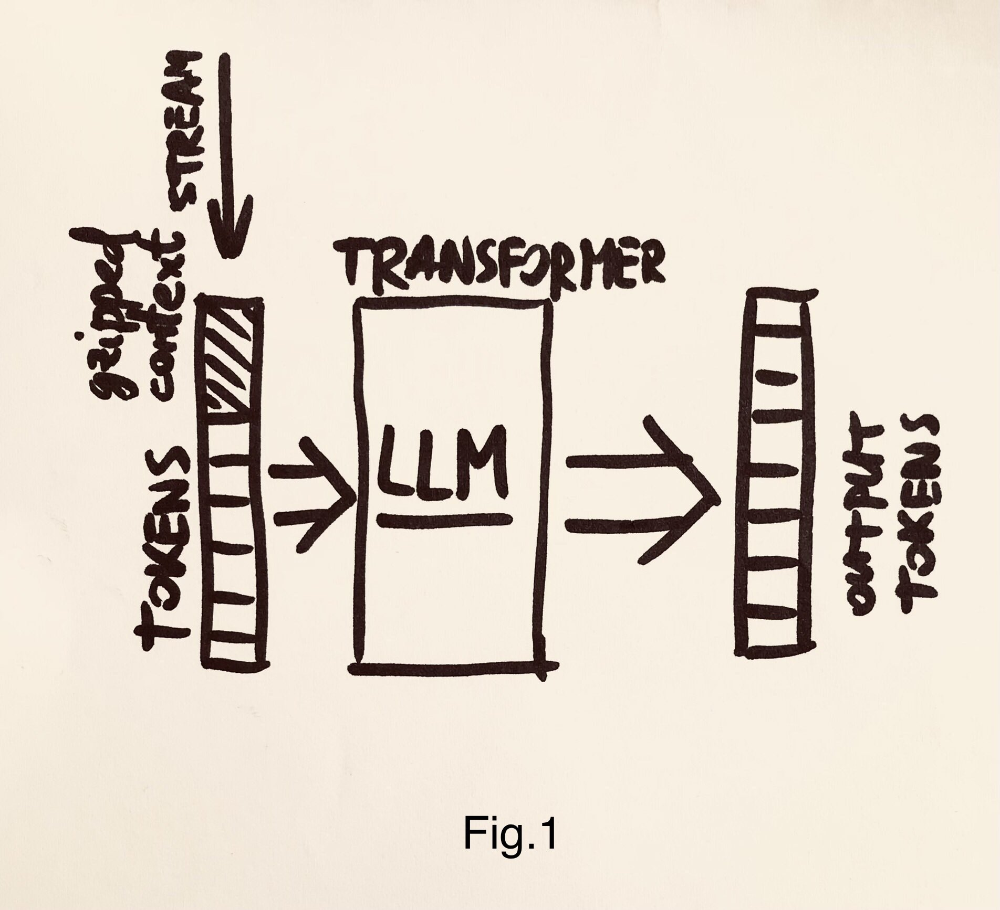

## GziPT - a gzip based LLM 

The code is forked from https://github.com/bazingagin/npc_gzip
Read the og paper: [ACL2023](https://aclanthology.org/2023.findings-acl.426/).

The main concept is to gzip the previous (long) context and feed it into the LLM together with raw tokens



### Require

```
torch
torchdata
torchtext==0.11 (for dataset)
numpy
pathos (if need multiprocessing)
scikit-learn
tqdm
unidecode
datasets
```

### Run

```
python main_text.py
```
By default, this will only use 100 test and training samples per class as a quick demo. They can be changed by `--num_test`, `--num_train`.

```
--compressor <gzip, lzma, bz2>
--dataset <AG_NEWS, SogouNews, DBpedia, YahooAnswers, 20News, Ohsumed_single, R8, R52, kinnews, kirnews, swahili, filipino> [Note that for small datasets like kinnews, default 100-shot is too big, need to set --num_test and --num_train.]
--num_train <INT>
--num_test <INT>
--data_dir <DIR> [This needs to be specified for R8, R52 and Ohsumed.]
--all_test [This will use the whole test dataset.]
--all_train
--record [This will record the distance matrix in order to save for the future use. It's helpful when you when to run on the whole dataset.]
--test_idx_start <INT>
--test_idx_end <INT> [These two args help us to run on a certain range of test set. Also helpful for calculating the distance matrix on the whole dataset.]
--para [This will use multiprocessing to accelerate.]
--output_dir <DIR> [The output directory to save information of tested indicies or distance matrix.]

```

### Calculate Accuracy (Optional)

If we want to calculate accuracy from recorded distance file <DISTANCE DIR>, use

```
python main_text.py --record --score --distance_fn <DISTANCE DIR> 
```
to calculate accuracy. Otherwise, the accuracy will be calculated automatically using the command in the last section.
